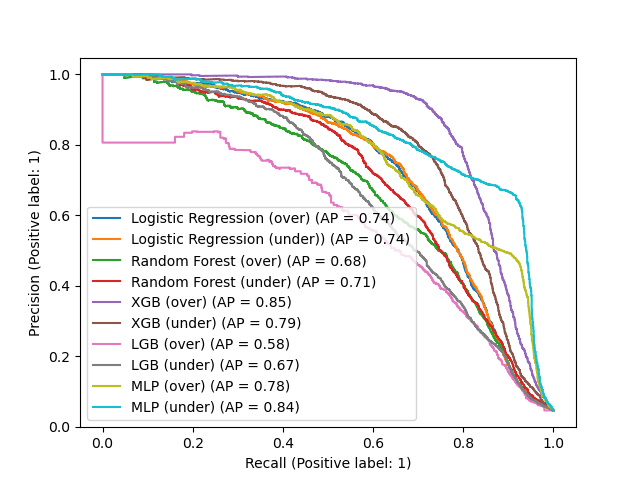

# Fraud Detection Project
### Absract
This project was done to find the most robust model in detection of fraud transactions. The analyzed models were: logistic regression, random forest classifier, xgb, and lgbm. The best results yield XGB.

### Goal
Detect, if the transaction is fraud or not.

### Data
Data comes from [Kaggle](https://www.kaggle.com/datasets/ban7002/fraud-challenge-data). It's a dataset containing 26 variables and 150 000 observations.

### Requirments
Needed packages are listed in requirments.txt file. To visualize '.dot' files [GraphViz] (https://dreampuf.github.io/GraphvizOnline) can be used.
